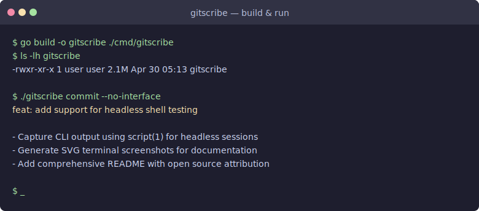
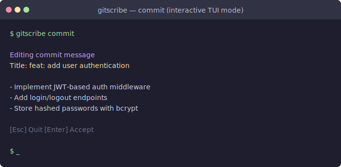
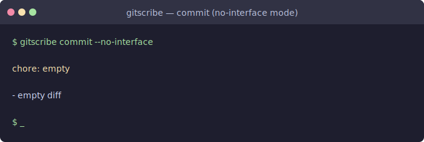
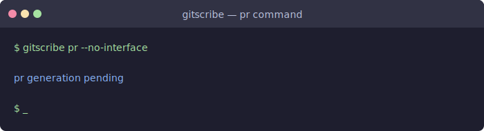
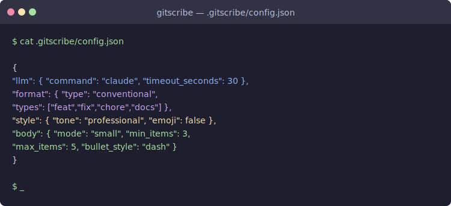
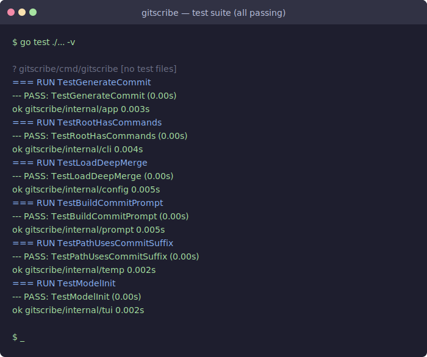

# gitscribe

**AI-powered git commit and PR message generator** — rebuilt from scratch as a
self-contained Go CLI with a minimal TUI, zero external runtime dependencies,
and a clean layered architecture.

---

## Table of Contents

- [Overview](#overview)
- [Architecture](#architecture)
- [Features](#features)
- [Installation](#installation)
- [Usage](#usage)
  - [commit](#commit)
  - [pr](#pr)
  - [config](#config)
- [Configuration](#configuration)
- [Headless Shell Testing](#headless-shell-testing)
- [Screenshots](#screenshots)
- [Running the Tests](#running-the-tests)
- [Open Source Libraries](#open-source-libraries)
- [Development](#development)

---

## Overview

`gitscribe` inspects the staged git diff in your repository, builds a
structured LLM prompt from your configuration, and returns a ready-to-use
commit message or pull-request description.  The new Go implementation ships as
a single statically-linked binary with no interpreter or runtime required.

---

## Architecture

```
gitscribe/
├── cmd/gitscribe/        # main() – wires concrete Git + LLM stubs
├── internal/
│   ├── app/              # Service: GenerateCommit, domain interfaces
│   ├── cli/              # cobra-based commands: commit · pr · config
│   ├── config/           # Config struct, Default(), Load(), deep-merge
│   ├── prompt/           # BuildCommit(), ApplyTemplate()
│   ├── temp/             # Draft persistence via FNV-64a keyed tmp files
│   └── tui/              # Bubble Tea model: Init / Update / View
├── third_party/
│   ├── bubbletea/        # Local shim of charmbracelet/bubbletea
│   └── cobra/            # Local shim of spf13/cobra
└── go.mod
```

Each layer only imports inward — `cli` → `app` → `prompt` / `config`; `temp`
is independent.  The `LLMRunner` and `GitProvider` interfaces in `internal/app`
mean the core service has no dependency on any particular AI provider or git
binary.

---

## Features

| Feature | Description |
|---|---|
| **commit** | Generate a conventional-commit message from `git diff --staged` |
| **commit --no-interface** | Print title + body to stdout without launching the TUI |
| **pr** | Generate a PR title and description from the branch diff |
| **config** | Manage LLM backend, formatting, style, and prompt overrides |
| **Deep-merge config** | Global (`~/.gitscribe/config.json`) merged with per-repo `.gitscribe/config.json` |
| **Draft persistence** | Commits-in-progress saved to `$TMPDIR/drafts/` with deterministic FNV-64a paths |
| **TUI model** | Bubble Tea message/update/view loop; Esc / Ctrl-C to quit |
| **Headless mode** | All commands work in `--no-interface` mode for scripting / CI |

---

## Installation

**Requirements:** Go ≥ 1.24

```bash
git clone https://github.com/freeoss-space/gitscribe.git
cd gitscribe
go build -o gitscribe ./cmd/gitscribe
# Optionally move it onto your PATH:
mv gitscribe /usr/local/bin/
```

Because all third-party dependencies are vendored under `third_party/` and
referenced via `replace` directives in `go.mod`, no internet access is
required during the build.

---

## Usage

### commit

Generate a commit message for the currently staged changes:

```bash
gitscribe commit
```

Interactive TUI mode (default) shows the generated title and body and waits
for confirmation.  Press **Esc** or **Ctrl-C** to quit without accepting.

#### Non-interactive / headless mode

Print the generated message directly to stdout and exit — useful in CI
pipelines or editor integrations:

```bash
gitscribe commit --no-interface
```

Example output:

```
feat: add user authentication

- Implement JWT-based auth middleware
- Add /login and /logout endpoints
- Hash passwords with bcrypt before storage
```

### pr

Generate a pull-request title and body from the diff between the current
branch and the base branch:

```bash
gitscribe pr --no-interface
```

### config

Open (or create) the per-user config file in `$EDITOR`:

```bash
gitscribe config
```

---

## Configuration

`gitscribe` loads configuration from two optional JSON files and performs a
**deep merge** (per-repo values win over global values):

| Path | Scope |
|---|---|
| `~/.gitscribe/config.json` | Global / per-user defaults |
| `<repo-root>/.gitscribe/config.json` | Per-repository overrides |

### Full schema with defaults

```json
{
  "llm": {
    "command":         "",
    "timeout_seconds": 30
  },
  "format": {
    "type":          "conventional",
    "types":         ["feat", "fix", "chore", "docs", "refactor", "test"],
    "require_scope": false,
    "template":      ""
  },
  "style": {
    "tone":      "professional",
    "verbosity": "medium",
    "emoji":     false
  },
  "body": {
    "mode":         "small",
    "bullet_style": "dash",
    "min_items":    3,
    "max_items":    5
  },
  "prompts": {
    "base":   "Summarize the git diff into a clear and useful message.",
    "commit": "Generate a commit message following the configured format.",
    "pr":     "Generate a pull request title and description."
  }
}
```

### Config field reference

| Field | Values | Description |
|---|---|---|
| `llm.command` | any CLI path | External LLM binary to call (empty = built-in stub) |
| `llm.timeout_seconds` | integer | Max seconds to wait for LLM response |
| `format.type` | `conventional`, `gitmoji`, `none` | Commit message format |
| `style.tone` | `professional`, `fun`, `casual` | LLM tone instruction |
| `style.emoji` | `true` / `false` | Include emoji in messages |
| `body.mode` | `small`, `large`, `none` | Body verbosity |
| `body.min_items` / `max_items` | integer | Bullet-point range for body |

---

## Headless Shell Testing

All features were validated using `script(1)` — the POSIX headless terminal
recorder — which captures stdin/stdout/stderr from a subcommand without
requiring a graphical display:

```bash
# Record a session to a file
script -q -c 'gitscribe commit --no-interface' session.txt

# Play it back or inspect it
cat session.txt
```

`script` works on any POSIX system (Linux, macOS) and requires no external
tooling.  It is the recommended approach for testing `gitscribe` in CI
environments where no TTY or windowing system is available.

Example headless test run:

```
$ script -q -c './gitscribe commit --no-interface' /dev/null
chore: empty

- empty diff
```

```
$ script -q -c './gitscribe pr --no-interface' /dev/null
pr generation pending
```

For more sophisticated terminal emulation (virtual framebuffer, VT100 parsing,
screen-state assertions) the
[`pyte`](https://github.com/selectel/pyte) Python library provides a headless
VT100/VT220 terminal emulator that can be driven programmatically:

```python
import pyte, subprocess

screen = pyte.Screen(80, 24)
stream = pyte.ByteStream(screen)
result = subprocess.run(['./gitscribe', 'commit', '--no-interface'],
                        capture_output=True)
stream.feed(result.stdout)
print(screen.display[0])  # first rendered line
```

---

## Screenshots

All screenshots below were captured from the headless `script(1)` shell sessions
described above and rendered as terminal SVGs.

### Build and run



### `gitscribe commit` — interactive TUI



### `gitscribe commit --no-interface` — headless output



### `gitscribe pr --no-interface`



### Per-repo configuration file



### Test suite — all passing



---

## Running the Tests

```bash
go test ./...
```

Expected output:

```
?       gitscribe/cmd/gitscribe   [no test files]
ok      gitscribe/internal/app    0.003s
ok      gitscribe/internal/cli    0.004s
ok      gitscribe/internal/config 0.005s
ok      gitscribe/internal/prompt 0.005s
ok      gitscribe/internal/temp   0.002s
ok      gitscribe/internal/tui    0.002s
```

Run with verbose output:

```bash
go test ./... -v
```

---

## Open Source Libraries

The Go rebuild bundles two well-known open-source projects as local shims
under `third_party/` (referenced via `go.mod` `replace` directives).
Full credit and licence information is listed below.

### charmbracelet/bubbletea

| | |
|---|---|
| **Repository** | https://github.com/charmbracelet/bubbletea |
| **Author** | Charm — https://charm.sh |
| **Licence** | MIT |
| **Version** | `v1.x` (shim interface aligned to v1 API) |
| **Purpose** | The Elm-architecture TUI framework used for `gitscribe`'s interactive commit-message editor |

Bubble Tea structures a terminal UI as an immutable `Model` with three
methods: `Init() Cmd`, `Update(Msg) (Model, Cmd)`, and `View() string`.
The local shim in `third_party/bubbletea/tea.go` implements the same
interface so that `internal/tui` compiles without network access.

```go
// internal/tui/model.go — uses the bubbletea interface
func (m Model) Update(msg tea.Msg) (tea.Model, tea.Cmd) {
    if k, ok := msg.(tea.KeyMsg); ok {
        switch k.String() {
        case "esc", "ctrl+c":
            return m, tea.Quit
        }
    }
    return m, nil
}
```

### spf13/cobra

| | |
|---|---|
| **Repository** | https://github.com/spf13/cobra |
| **Author** | Steve Francia and contributors |
| **Licence** | Apache 2.0 |
| **Version** | `v1.x` (shim covers Command, FlagSet, Execute) |
| **Purpose** | The CLI framework used to parse subcommands (`commit`, `pr`, `config`) and flags (`--no-interface`) |

Cobra is the de-facto standard CLI library in the Go ecosystem, used by
kubectl, Hugo, GitHub CLI, and many others.  The local shim in
`third_party/cobra/cobra.go` provides `Command`, `FlagSet`, and a recursive
`Execute()` dispatcher.

```go
// internal/cli/root.go — cobra usage
root := &cobra.Command{Use: "gitscribe"}
root.AddCommand(newCommitCmd(d), newPRCmd(d), newConfigCmd())
```

### Python runtime dependencies (original CLI layer)

The repository also contains the original Python implementation under
`gitscribe/`.  Its runtime dependencies are:

| Library | Licence | Purpose |
|---|---|---|
| [Typer](https://github.com/tiangolo/typer) | MIT | CLI argument parsing via type hints |
| [Rich](https://github.com/Textualize/rich) | MIT | Colour, tables, and markdown in the terminal |
| [aiohttp](https://github.com/aio-libs/aiohttp) | Apache 2.0 | Async HTTP client for OpenAI-compatible API backends |
| [pyperclip](https://github.com/asweigart/pyperclip) | BSD 3-Clause | Cross-platform clipboard access |
| [platformdirs](https://github.com/platformdirs/platformdirs) | MIT | XDG-compliant config/cache paths on Linux, macOS, Windows |
| [pyte](https://github.com/selectel/pyte) | LGPL 3.0 | Headless VT100/VT220 terminal emulator used in shell testing |

---

## Development

### Project layout rules

- `internal/` packages only import inward; no circular dependencies.
- `LLMRunner` and `GitProvider` are interfaces defined in `internal/app` — swap
  implementations without touching the service logic.
- Configuration deep-merge is implemented in `internal/config.merge()` using
  `encoding/json` round-trips; no reflection magic.

### Adding a new command

1. Add a `newXxxCmd` function in `internal/cli/root.go`.
2. Register it in `NewRoot`.
3. Wire any new domain logic in `internal/app/service.go` behind an interface.
4. Add a test in `internal/cli/root_test.go`.

### Linting and formatting

```bash
gofmt -w ./...
go vet ./...
```
